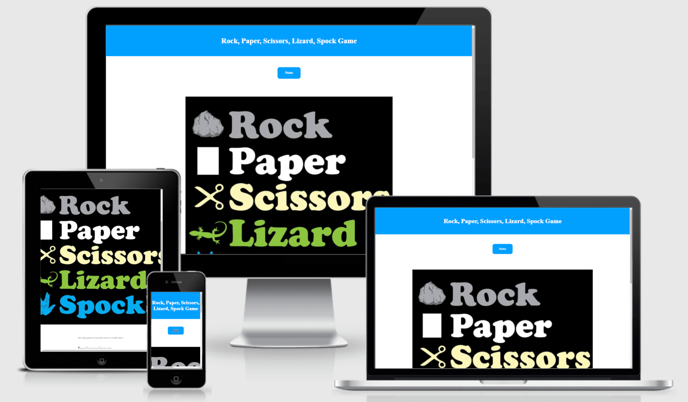
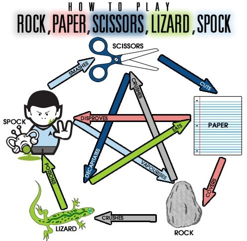
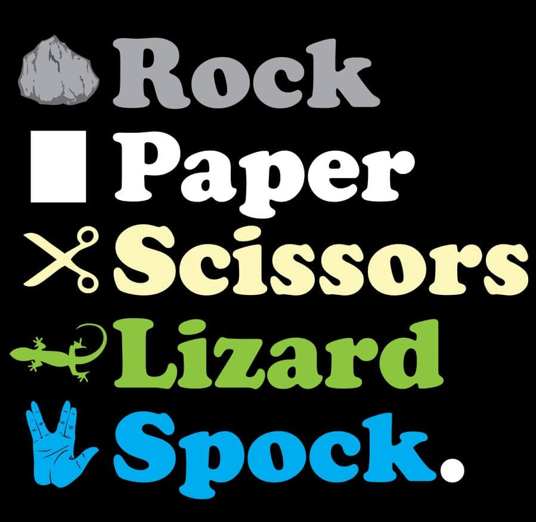

# RPSLS

## Contents

1. [Contents](#contents)
2. [Name](#name)
3. [Description](#discription)
4. [Badges](#badges)
5. [Features](#features)
6. [How to Use The Game](#how-to-play-the-game)
7. [Testing](#testing)
6. [Bugs](#bugs)
9. [Technologies](#technologies)
10. [Credits](#credits)
11. [Deployment](#deployment)
12. [Licence](#licence)
13. [Project status](#project-status)

## Name

RPSLS - or better known as Rock Paper Scissors Lizard Spock

## Description

Have you ever needed a way to decide something, feel a flip of a coin is too cliche or rock paper scissors is too easy to just have a draw game? Then look no further, Rock Paper Scissors Lizard Spock allows you a first to 5 way of deciding what ever youd like or just play for fun or to pass the time.
A simple design that allows you to see the rules in 2 different forms (an image or video), five buttons that allow you to make your selection for the game, a simplae score board and a modal tht will pop up to tell you the outcome of the game aloows quick and easy to understand way of playing.
This game is made with bright primary colours with children in mind.

## Features

This game is aimed at a younger demographic and so i chose to use bright colours in order to best attract them to the game. I opted to use the default font family as this will be safest for any browser and clear enough so as not to confuse children when reading it.

### Rules

The rules will be displayed using two different media types an image for quick reference or an embedded you tube extract from the big bang theory to better explain the game.

1. 
---

2. 

### Game play

To start the game the user will click one of 5 buttons these buttons will be passed into a function that compares the users choice to the computers choice which is found from a randomly generated number. This is then passed to a modal stating the users choice and the computers choice aswell as the outcome of the game, it then increments the score for the computer or the player.

### Keeping track of the score

Each time a game is won or lost the corresponding increment function will be called this will update the score board. If either score is equal to or greater than 5 a modal will appear saying game over and allowing you to reset the scores, once this is clicked both scores will be reset back to 0, ready to play again.

## How to Use The Game

1. There is a rules button that allows you to have a modal open displaying an image with the rules on and a video with rules on.
2. To play the game you simplay click on one of the buttons you will then be displayed with you have won lost or drew and the score is incremented.
3. close the modal and play again util either side gets 5 points the game is then over and you can reset the game.

## Testing

How i have tested the code:
* I have checked each of the buttons ensuring they give the desired outcome.
* I have console logged each of the outtcome at verious stages and compared the outcomes.
* I have tested the rules button several times, upon clicking it the rules image and video would appear clicking the x closed the modal.
* I tested the game by clicking the first button (paper)
* I checked the out come of what the modal said to ensure it was as it should be.
* I checked that each time the player chose something and that the game was either a win or a loss one of the scores would be incremented.
* I clicked the ok button which closed the modal.
* I then repeated to click on the paper icon, check the outcome enetered in the modal and click on the ok button to close the modal untill either of the scores reached 5. 
* I checked that when one of the scores reached 5 and the results modal was closed tht the game over modal would display.
* I then clicked reset and checked that the scores were reset to 0.
* I repeated these steps 3 times.
I then repeated the above steps for all of the other buttons.

### Bugs

1. while writing the site i noticed an issue between clicking play game and Rules buttons where one would not replace the other instead they would stack on top of each other.

2. Video wont display on modal - This was caused by a rogue line of code in the Java Script setting the display of the video to none.

3. Modal wont close when button is clicked - This was caused by several typos when resolved the modals closed as intended.

### Validation
* HTML - No errors returned from [w3C validator](https://validator.w3.org/nu/#textarea)
* CSS -
* JavaScript - No errors were returned from [JS Hint](https://jshint.com/), the metrics were as follows :-
    * There are 17 functions in this file.
        *  Function with the largest signature take 1 arguments, while the median is 0.
        * Largest function has 28 statements in it, while the median is 2.
        * The most complex function has a cyclomatic complexity value of 17 while the median is 1.

## Deployment

1. Go to https://github.com/
2. Select the correct repositry
3. Click settings
4. Click pages
5. Select source and choose master
6. Your sites path will now be shown

